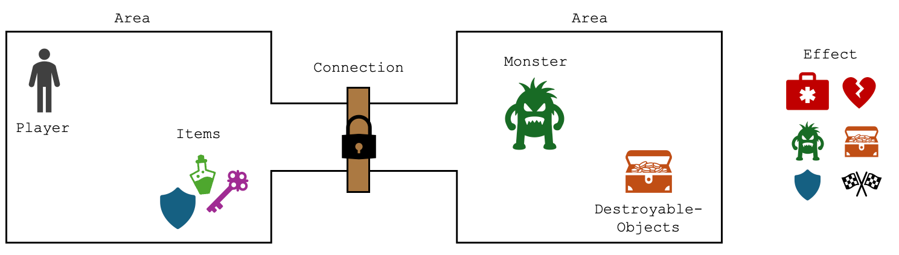
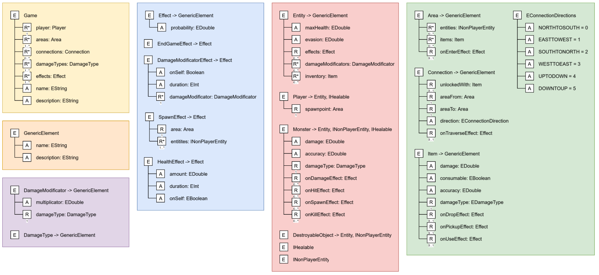

# Model and Conquer
> A domain architecture to model text-based adventure games
> inspired by the classic "Zork" game.

## Features

- Create text-based adventure/ dungeon crawler games using a domain-specific language
- Game elements
  - Areas (Rooms with connections, entities, items)
  - Connections (🚪🔒 Doors, passages)
  - Entities (👤 Player, 🧌 monsters, 🏺 destroyable objects)
  - Items (📿 Collectible objects, ⚔️ weapons, 🔑 keys)
  - Effects (❤️💀Health, 🛡️ Stats, ✨🧌 Summon, 🏁 End Game) (at least most of the time)

## Technologies:
- Eclipse Modeling Framework (EMF)
- Encore (metamodel and model definition)
- Xtend (Transformation language)
- Java (Runtime, Platform)

## Meta Model

## Static Semantics

- Game must have an end game effect
- Each area must have at least one connection
- Each name must not contain a preposition like "with" or "on"
- OnSpawnEffect must not be a SpawnEffect (recursion is bad)

## How to run the project

### Pre-requisites
- Install Eclipse Modeling Framework
- Install Xtend Plugin
- Clone repository
- Import project into Eclipse

### Create a new model
- Open the `ModelAndConquer.editor` project in Eclipse
- Run the project as an Eclipse Application
- Create a new `.modelandconquer` model using the provided editor

### Generate the game
- Right-click on the root game element in the model editor
- Select `Start Generator`

### Run the game
- Copy the generated source code located in src-gen to `ModelAndConquer.editor/src/models/generated`
- Run the game by executing the main method in `ModelAndConquer.editor/src/models/_static/Game.java`